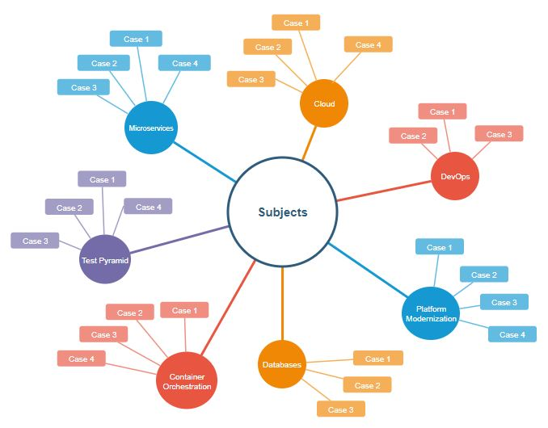

# Lições apreendidas, Lições compartilhadas!

Os cases compartilhados estão organizados por temas e podem ser encontrados nos links abaixo ou podem ser pesquisados por palavras chave na busca do repositório:

[Cloud](https://github.com/cristianom-ciandt/Lessons-Learned/tree/master/Subjects/Cloud)

[Container-Orchestration](https://github.com/cristianom-ciandt/Lessons-Learned/tree/master/Subjects/Container-Orchestration)

[Database](https://github.com/cristianom-ciandt/Lessons-Learned/tree/master/Subjects/Database)

[DevOps](https://github.com/cristianom-ciandt/Lessons-Learned/tree/master/Subjects/DevOps)

[Engineering](https://github.com/cristianom-ciandt/Lessons-Learned/tree/master/Subjects/Engineering)

[Microservices](https://github.com/cristianom-ciandt/Lessons-Learned/tree/master/Subjects/Microservices)

[Platform Modernization](https://github.com/cristianom-ciandt/Lessons-Learned/tree/master/Subjects/Platform-Modernization)

[Quality Assurance](https://github.com/cristianom-ciandt/Lessons-Learned/tree/master/Subjects/Quality-Assurance)

[Message Broker](https://github.com/cristianom-ciandt/Lessons-Learned/tree/master/Subjects/Message-Broker)

[Test Pyramid](https://github.com/cristianom-ciandt/Lessons-Learned/tree/master/Subjects/Test-Pyramid)

# Instruções para a escrita de cases:

## Diagrama da organização de assuntos/temas:

## Exemplos de cases:

[Reduzindo o leadtime da construção de experimentos](https://github.com/cristianom-ciandt/Lessons-Learned/tree/master/Subjects/Engineering/Case1/)

[Resolvendo problemas de consumidores concorrentes em filas de mensagens numa arquitetura de microserviços](https://github.com/cristianom-ciandt/Lessons-Learned/tree/master/Subjects/Message-Broker/Case1/)

## Caso não exista um tema específico para adicionar o novo case:

* [Utilize o template de tema](https://github.com/cristianom-ciandt/Lessons-Learned/tree/master/Subjects/Tema%20Template);

* [Utilize o template de case](https://github.com/cristianom-ciandt/Lessons-Learned/tree/master/Subjects/Case%20Template);

* Após finalizar a estruturação do tema, adicione o link para o tema no arquivo README..MD da pasta raiz.

## Caso já exista um tema específico para adicionar o novo case:

* Utilize o template de case;

## Extensão útil para o visual studio code:
* Markdown Preview Github Styling

## Após finalizar a preparação do conteúdo case, adicione:

O link para o case no arquivo README..MD da pasta do tema.